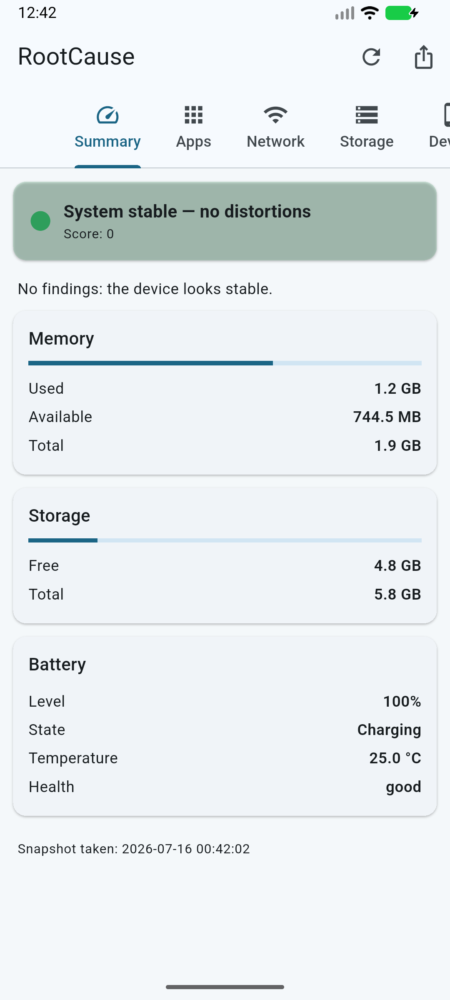
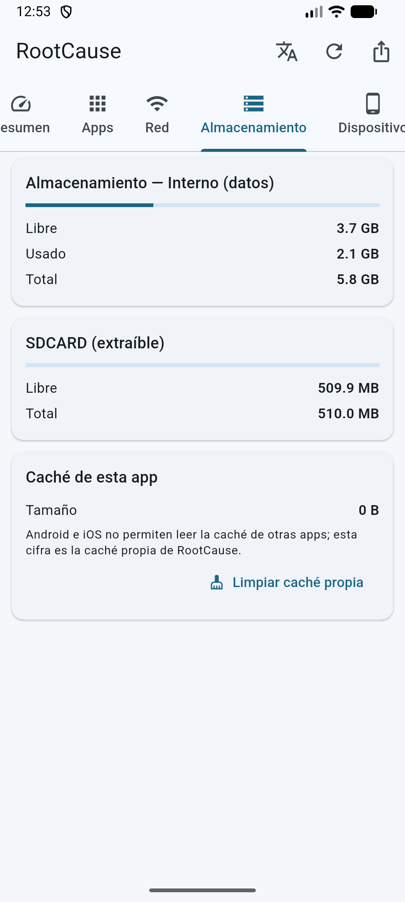
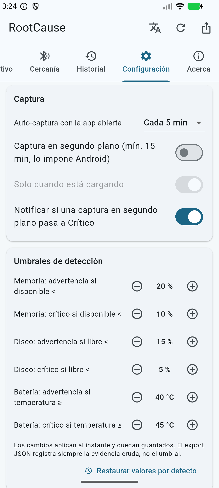
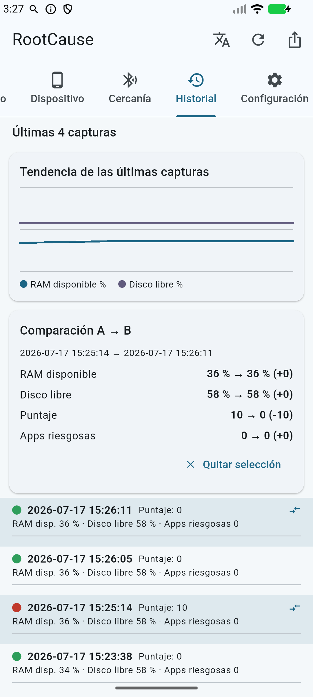
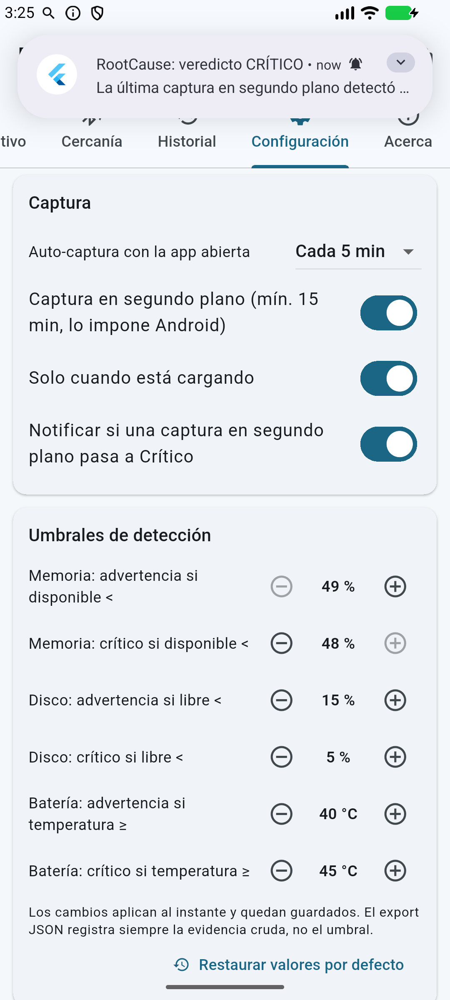
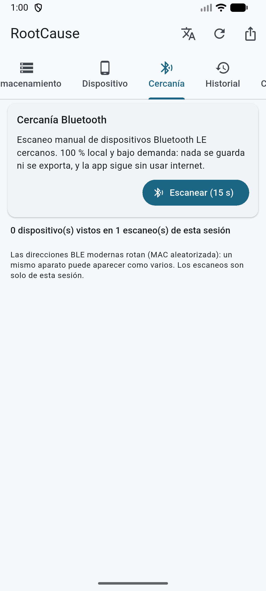
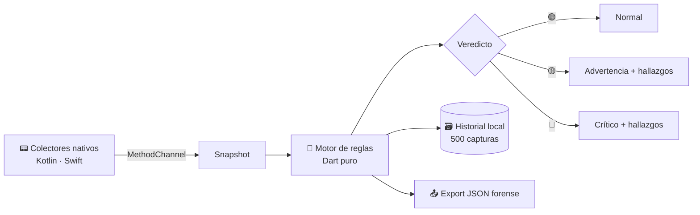

# RootCause Mobile Inspector

```text
╔═══════════════════════════════════════════════════════════════════════════════════╗
║                                                                                   ║
║  ██████╗  ██████╗  ██████╗ ████████╗ ██████╗  █████╗ ██╗   ██╗███████╗███████╗    ║
║  ██╔══██╗██╔═══██╗██╔═══██╗╚══██╔══╝██╔════╝ ██╔══██╗██║   ██║██╔════╝██╔════╝    ║
║  ██████╔╝██║   ██║██║   ██║   ██║   ██║      ███████║██║   ██║███████╗█████╗      ║
║  ██╔══██╗██║   ██║██║   ██║   ██║   ██║      ██╔══██║██║   ██║╚════██║██╔══╝      ║
║  ██║  ██║╚██████╔╝╚██████╔╝   ██║   ╚██████╗ ██║  ██║╚██████╔╝███████║███████╗    ║
║  ╚═╝  ╚═╝ ╚═════╝  ╚═════╝   ╚═╝    ╚═════╝ ╚═╝  ╚═╝ ╚═════╝╚══════╝╚══════╝      ║
║                                                                                   ║
║                          M O B I L E   I N S P E C T O R                          ║
║                  Sensor forense de diagnóstico · Flutter · v0.4.0                 ║
╚═══════════════════════════════════════════════════════════════════════════════════╝
```

[](https://github.com/vladimiracunadev-create/rootcause-mobile-inspector/actions/workflows/ci.yml)
[](https://github.com/vladimiracunadev-create/rootcause-mobile-inspector/actions/workflows/release-android.yml)
[](LICENSE)
[](docs/LIMITACIONES.md)
[](docs/ROADMAP.md)

📲 **[Descargar APK (último release) →](https://github.com/vladimiracunadev-create/rootcause-mobile-inspector/releases/latest)**  ·  📘 **[Manual de usuario →](docs/MANUAL_USUARIO.md)** (qué es cada cosa, en claro)

---

**RootCause Mobile Inspector es el hermano móvil de
[rootcause-windows-inspector](https://github.com/vladimiracunadev-create/rootcause-windows-inspector):**
un sensor forense de diagnóstico para **Android e iOS**, construido con **Flutter**
(código compartido en Dart + colectores nativos en Kotlin y Swift).

Hereda la misma razón de existir: **cualquier distorsión anómala de los recursos
del dispositivo —memoria, almacenamiento, batería, red, superficie de permisos—
puede ser el primer indicio de que algo está ocurriendo.** RootCause vigila esas
distorsiones de forma agnóstica, las evalúa con un motor de reglas local y
explica el veredicto con evidencia. Todo se queda en el dispositivo: **cero
telemetría, cero red saliente.**

> **Diagnóstico primero. Intervención después.**

Es un **sensor de apoyo a la decisión**, no un antivirus: no elimina malware ni
bloquea nada — detecta indicios (presión de memoria, almacenamiento crítico,
temperatura anómala de batería, apps con superficie de permisos peligrosa,
indicadores de root/jailbreak) y deja evidencia exportable.

---

## 📱 Plataformas

| Plataforma | Estado | Distribución |
|---|---|---|
| **Android** (8.0+, API 26) | Producción | APK firmado en [Releases](../../releases) |
| **iOS** (13+) | Compila en CI (`--no-codesign`) · distribución **en pausa** | Requiere cuenta Apple Developer → [`docs/RELEASE_MOVIL.md`](docs/RELEASE_MOVIL.md) |

El código compartido (`lib/`) es idéntico en ambas plataformas; los colectores
nativos declaran honestamente qué puede observarse en cada sistema operativo
(→ [`docs/LIMITACIONES.md`](docs/LIMITACIONES.md)).

---

## ⚡ Inicio rápido

```bash
# 1. Dependencias
flutter pub get

# 2. Validar (formato + análisis + tests)
dart format --output=none --set-exit-if-changed lib test
flutter analyze
flutter test

# 3. Ejecutar en un dispositivo conectado
flutter run

# 4. APK release
flutter build apk --release
```

> Guía completa de build por plataforma → [`docs/BUILD_MOVIL.md`](docs/BUILD_MOVIL.md)

---

## 🔍 Qué problema resuelve

| Pregunta | Cómo RootCause ayuda |
|---|---|
| ¿Por qué el teléfono va lento? | Semáforo global + presión de memoria y almacenamiento con umbrales |
| ¿Qué app tiene una superficie de permisos peligrosa? | Auditoría de permisos peligrosos por app con puntaje de riesgo (Android) |
| ¿Hay indicios de root/jailbreak? | Indicadores honestos (binarios `su`, build `test-keys`) — indicio, no prueba |
| ¿La batería se comporta raro? | Temperatura, salud y estado de carga con umbrales de alerta |
| ¿Cómo dejo evidencia del estado actual? | Export JSON forense + historial local de capturas |

---

## 📸 Capturas

v0.2.0 corriendo en el emulador AVD oficial (el APK universal incluye la
ABI `x86_64`; verificada también en dispositivo Android real):

<p align="center">
  
  &nbsp;&nbsp;
  
  &nbsp;&nbsp;
  
</p>

<p align="center">
  
  &nbsp;&nbsp;
  
  &nbsp;&nbsp;
  
</p>

---

## 🛡️ Secciones de la app

| Pestaña | Descripción |
|---|---|
| **Resumen** | Semáforo global + hallazgos con evidencia, recomendación y **botón de intervención** (abre la pantalla del sistema donde tú sí puedes actuar) |
| **Apps** | Auditoría de permisos peligrosos por app + **tiempo en pantalla 24 h** con el acceso de uso (opt-in), ordenado por consumo, con acceso a la ficha del sistema — Android |
| **Red** | Transporte activo (WiFi/celular), VPN, red medida, ancho de banda estimado y tráfico acumulado |
| **Almacenamiento** | Volumen interno **+ tarjeta SD/USB si existen** (detección dinámica) + caché propia con botón de limpieza |
| **Dispositivo** | Hardware, versión de OS, parche de seguridad e indicadores de root/jailbreak |
| **Cercanía** | Escaneo Bluetooth LE manual (opt-in) con marca de **persistencia** — sin usar internet |
| **Historial** | Gráfico de **tendencia** (RAM/disco), **comparación A→B** con deltas, y la regla de carga en ascenso alimentada por la auto-captura |
| **Configuración** | Auto-captura (5 min por defecto, como la edición Windows), captura en segundo plano (solo-cargando opcional) con **alerta local de crítico**, umbrales modificables e idioma |
| **Acerca** | Versión, autor, filosofía y política de privacidad local |

Toda captura puede exportarse como **JSON forense** con ids de hallazgo neutrales
al idioma (comparables entre dispositivos y con la edición Windows).

---

## 🧠 Motor de reglas local



El mismo principio que el rule engine del RootCause de escritorio, portado a
Dart puro (100 % testeable sin dispositivo):

- Presión de memoria (umbral warning/critical sobre el ratio disponible)
- Almacenamiento crítico (ratio libre del volumen de datos)
- Temperatura y salud de batería
- Apps con puntaje de riesgo alto por superficie de permisos
- **Apps nuevas** (v0.3.0): baseline de instalaciones entre capturas — el
  `persistence-change` de la edición Windows, en móvil
- Indicadores de root/jailbreak
- **Parche de seguridad antiguo** (v0.4.0): ≥ 180 días warning, ≥ 365
  critical, con botón directo a la actualización del sistema
- **Carga en ascenso** (v0.2.0): caída sostenida de memoria/disco a lo
  largo del historial — la distorsión que crece como indicio temprano

Cada hallazgo lleva severidad, evidencia y recomendación. El veredicto global
es el máximo de severidad + un puntaje acumulado. Los umbrales son
**modificables** desde la pestaña Configuración (persisten localmente).

> Mapa honesto de qué detecta y qué NO puede detectar un sensor móvil →
> [`docs/DETECCION_AMENAZAS.md`](docs/DETECCION_AMENAZAS.md)

---

## 📐 Estructura del repositorio

```text
rootcause-mobile-inspector/
├── pubspec.yaml          ← versión, dependencias Flutter
├── lib/                  ← código compartido Dart
│   ├── main.dart         ← entrada + UI Material 3 (tabs, semáforo, export)
│   ├── core/
│   │   ├── models.dart   ← Snapshot, Finding, Verdict, VolumeInfo
│   │   ├── rule_engine.dart ← motor de reglas puro + regla de tendencia
│   │   ├── config_store.dart ← configuración persistente (umbrales, intervalos)
│   │   ├── nearby.dart   ← sesión BLE en memoria (persistencia de cercanía)
│   │   ├── snapshot_json.dart ← export forense JSON
│   │   └── history_store.dart ← historial local (JSON Lines)
│   ├── platform/collectors.dart ← puente MethodChannel a nativo
│   └── ui/               ← pantallas y tema
├── android/              ← colectores Kotlin + Worker de captura en 2.º plano
├── ios/                  ← proyecto iOS + colectores Swift (MethodChannel)
├── test/                 ← tests Dart del motor de reglas y export
├── docs/                 ← arquitectura, manual, CI, releases, limitaciones
└── .github/workflows/    ← ci.yml (Android+iOS+tests) · release-android.yml
```

---

## 🚀 Validación automática

- **`ci.yml`** — formato Dart, análisis estático, tests, build APK release
  (ubuntu) y build iOS sin firma (macos), en cada push/PR a `main`.
- **`release-android.yml`** — tag `v*` → tests como puerta + APK release
  firmado + `SHA256SUMS.txt` + GitHub Release automático.
- Actions pinneadas a commit SHA y permisos mínimos por workflow.

Guía completa → [`docs/CI_GITHUB.md`](docs/CI_GITHUB.md)

---

## 📦 Releases

Cada release Android publica:

| Archivo | Para quién |
|---|---|
| `…-android-arm64-v8a.apk` | **Recomendado**: teléfonos modernos de 64 bits (≈ 1/3 del peso) |
| `…-android-armeabi-v7a.apk` | Teléfonos antiguos de 32 bits |
| `…-android-universal.apk` | Cualquier equipo (más pesado: incluye todas las ABIs) |
| `SHA256SUMS.txt` | Hashes de integridad |

> ¿Por qué el universal pesa más? Empaqueta el engine de Flutter para 3
> arquitecturas de CPU. El trade-off completo (Flutter multiplataforma vs
> binario Rust de la edición Windows) está explicado con números en
> [`docs/ARCHITECTURE.md`](docs/ARCHITECTURE.md#trade-off-honesto-peso-del-apk-flutter-vs-rust).

### Instalar el APK en tu teléfono

1. Desde el teléfono, abre el [último release](../../releases/latest) y
   descarga el `.apk` **arm64-v8a** (o `universal` si no estás seguro).
2. Al abrirlo, Android pedirá autorizar la **instalación desde orígenes
   desconocidos** para tu navegador o gestor de archivos — es lo normal
   para apps fuera de Play Store.
3. (Recomendado) Verifica la integridad: el SHA-256 del archivo debe
   coincidir con `SHA256SUMS.txt` del release.
4. Abre **RootCause** y pulsa ↻ para tu primera captura.

> ¿No sabes cuál APK elegir? Guía completa con árbol de decisión →
> [`docs/TROUBLESHOOTING.md`](docs/TROUBLESHOOTING.md#cuál-apk-descargo-guía-completa)
> · ¿Sin teléfono a mano? Pruébalo en un emulador →
> [`docs/EMULADOR.md`](docs/EMULADOR.md)

Proceso completo (incluida la firma y el camino a iOS/App Store) →
[`docs/RELEASE_MOVIL.md`](docs/RELEASE_MOVIL.md)

---

## 📁 Estado de entrega del repositorio

### ✅ Incluye

- Código fuente completo (Dart compartido + Kotlin + Swift)
- APK release firmado publicado en Releases con hash de integridad
- Motor de reglas local con **umbrales modificables por el usuario** y 9 familias de hallazgo (incluidas la tendencia `load-rising`, el baseline `new-apps` y el parche antiguo `patch-old`)
- **Tiempo en pantalla por app** con el acceso de uso (opt-in real del usuario) y **widget de pantalla de inicio** con el semáforo
- Auto-captura configurable (5 min por defecto) + **captura en segundo plano** con WorkManager (opción solo-cargando) y **notificación local de veredicto crítico**
- **Historial con gráfico de tendencia y comparación A→B** (deltas de memoria, disco, puntaje y apps riesgosas)
- Auditoría de superficie de permisos por app (Android) con acceso a la ficha del sistema
- Volúmenes de almacenamiento (tarjeta SD/USB) detectados dinámicamente
- Escaneo Bluetooth LE opt-in (Cercanía) sin permiso INTERNET
- Historial local de capturas + export JSON forense
- Interfaz bilingüe (español por defecto, inglés a un toque) con tema claro/oscuro
- CI multiplataforma y release automatizado por tag (actions pinneadas a SHA)
- Documentación de arquitectura, operación, amenazas y límites por plataforma

### ❌ No incluye

- `.ipa` de iOS distribuible (requiere cuenta Apple Developer; **en pausa**)
- Publicación en Google Play / App Store
- Inspección de tráfico de red por app (fuera de alcance v0.1)
- Cualquier promesa que Android/iOS no permitan cumplir a una app de usuario

---

## ⚠️ Limitaciones honestas

- **iOS no permite listar apps instaladas ni inspeccionar otros procesos**: la
  auditoría de apps existe solo en Android; en iOS se reporta como no
  disponible por diseño del SO.
- **Android tampoco expone CPU/RAM de otras apps** desde Android 8: la
  auditoría trabaja sobre la superficie de permisos, no sobre consumo ajeno.
- Los indicadores de root/jailbreak son **indicios, no pruebas**.
- No es antivirus ni EDR; complementa, no reemplaza.

Detalle completo → [`docs/LIMITACIONES.md`](docs/LIMITACIONES.md)

---

## 📚 Rutas de lectura

| Perfil | Documento |
|---|---|
| 🧑‍💻 Desarrollador | [`docs/ARCHITECTURE.md`](docs/ARCHITECTURE.md) · [`docs/FLUTTER_PARA_ROOTCAUSE.md`](docs/FLUTTER_PARA_ROOTCAUSE.md) · [`docs/HEURISTICAS.md`](docs/HEURISTICAS.md) · [`docs/TESTING.md`](docs/TESTING.md) · [`docs/BUILD_MOVIL.md`](docs/BUILD_MOVIL.md) · [`docs/COMMANDS.md`](docs/COMMANDS.md) |
| 👤 Usuario final | [`docs/MANUAL_PARA_NOVATOS.md`](docs/MANUAL_PARA_NOVATOS.md) · [`docs/MANUAL_USUARIO.md`](docs/MANUAL_USUARIO.md) · [`docs/OPERACION.md`](docs/OPERACION.md) · [`docs/EMULADOR.md`](docs/EMULADOR.md) · [`docs/TROUBLESHOOTING.md`](docs/TROUBLESHOOTING.md) |
| 🛡️ Seguridad | [`docs/DETECCION_AMENAZAS.md`](docs/DETECCION_AMENAZAS.md) · [`docs/COMPARATIVA_OSS.md`](docs/COMPARATIVA_OSS.md) · [`docs/POLITICA_DE_PRIVACIDAD_LOCAL.md`](docs/POLITICA_DE_PRIVACIDAD_LOCAL.md) · [`SECURITY.md`](SECURITY.md) |
| 📋 Release | [`docs/RELEASE_MOVIL.md`](docs/RELEASE_MOVIL.md) · [`docs/RELEASE_CHECKLIST.md`](docs/RELEASE_CHECKLIST.md) · [`docs/CI_GITHUB.md`](docs/CI_GITHUB.md) · [`docs/ROADMAP.md`](docs/ROADMAP.md) |
| 🧭 Producto | [`docs/PLAN_MAESTRO.md`](docs/PLAN_MAESTRO.md) · [`docs/CATALOGO_PRODUCTO.md`](docs/CATALOGO_PRODUCTO.md) · [`docs/LICENCIA_Y_DECISION.md`](docs/LICENCIA_Y_DECISION.md) · [`docs/RECLUTADORES.md`](docs/RECLUTADORES.md) |
| 📑 Todo | [`docs/INDEX.md`](docs/INDEX.md) |

---

## 📄 Licencia

Apache 2.0 — ver [`LICENSE`](LICENSE).

## ✍️ Autor

Vladimir Acuña · [@vladimiracunadev-create](https://github.com/vladimiracunadev-create)
