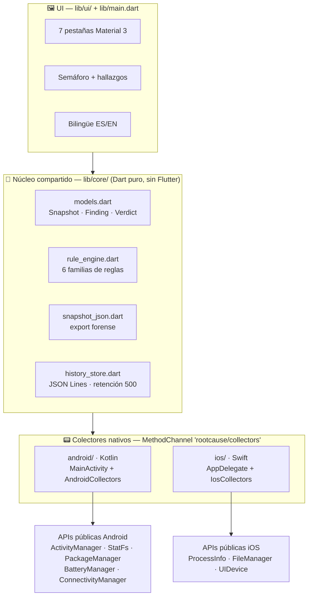
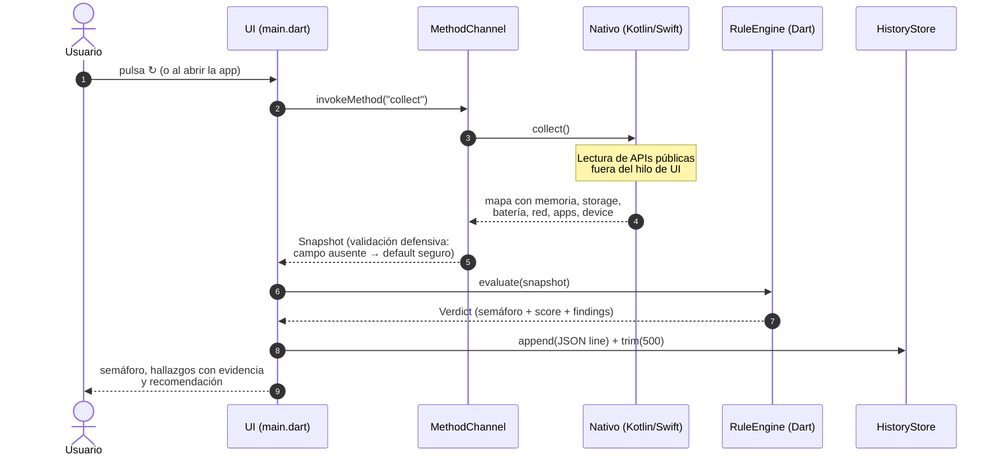

# Arquitectura

## Visión general

RootCause Mobile Inspector usa **Flutter** con una separación estricta en tres capas:



### Por qué Flutter

- Un solo código para UI + motor de reglas + export en Android e iOS.
- Los colectores (lo único que de verdad difiere por SO) quedan aislados
  en un MethodChannel por plataforma.
- El motor de reglas es **Dart puro**: se testea en CI sin emulador.

## El contrato del MethodChannel

Canal: `rootcause/collectors`, con dos métodos:

- `collect` → mapa completo de estado (abajo)
- `documentsPath` → ruta del directorio de documentos del sandbox
  (historial y exports; evita depender del plugin `path_provider`)

El método `collect` devuelve:

```jsonc
{
  "memory":  { "totalBytes": 0, "availableBytes": 0, "lowMemory": false },
  "storage": { "totalBytes": 0, "freeBytes": 0, "appCacheBytes": 0 },
  "battery": { "levelPercent": 0, "charging": false, "temperatureCelsius": 0.0,
               "voltageMillivolts": 0, "healthy": true, "healthLabel": "good" },
  "network": { "connected": true, "transport": "wifi", "vpnActive": false,
               "metered": false, "downstreamKbps": 0, "upstreamKbps": 0,
               "totalRxBytes": 0, "totalTxBytes": 0 },
  "apps":    [ { "packageName": "...", "label": "...", "versionName": "...",
                 "dangerousPermissions": [], "specialFlags": [],
                 "sideloaded": false } ],
  "device":  { "manufacturer": "...", "model": "...", "osVersion": "...",
               "sdkInt": 0, "securityPatch": "...", "cpuCores": 0,
               "uptimeMillis": 0, "rootIndicators": [],
               "appsAuditSupported": true }
}
```

Reglas del contrato:

- **Campos siempre presentes** con defaults seguros; el Dart valida tipos y
  degrada a valores neutros si falta algo (nunca crashea por el nativo).
- `appsAuditSupported=false` en iOS: la UI muestra "no disponible por diseño
  del SO" en vez de una lista vacía engañosa.
- Los ids de hallazgo (`mem-pressure`, `storage-low`, `battery-temp`,
  `battery-health`, `risky-apps`, `root-indicators`) son estables y neutrales
  al idioma — mismos principios que la edición Windows.

## Ciclo de vida de una captura



## Motor de reglas (lib/core/rule_engine.dart)

Función pura `Snapshot → Verdict`:

| Regla | Warning | Critical |
|---|---|---|
| `mem-pressure` | disponible < 20 % | disponible < 10 % o flag lowMemory |
| `storage-low` | libre < 15 % | libre < 5 % |
| `battery-temp` | ≥ 40 °C | ≥ 45 °C |
| `battery-health` | salud reportada ≠ good/unknown | — |
| `risky-apps` | ≥ 1 app con score ≥ 8 | ≥ 5 apps con score ≥ 8 |
| `root-indicators` | ≥ 1 indicador | — |

Puntaje de riesgo por app (Android): +1 por permiso peligroso solicitado,
+3 por `SYSTEM_ALERT_WINDOW` u `REQUEST_INSTALL_PACKAGES`, +2 por
device-admin, +2 por sideload.

Veredicto global = máxima severidad; puntaje = Σ (warning=3, critical=10).
Umbrales centralizados en `RuleThresholds` (testeables y evolucionables).

## Persistencia e historial

`history_store.dart` guarda cada captura como una línea JSON (JSON Lines) en
el directorio de documentos de la app, con retención acotada (500 líneas).
Sin SQLite ni plugins nativos extra: menos superficie, misma evidencia.

## Export forense

`snapshot_json.dart` serializa snapshot + veredicto con `dart:convert`
(`schemaVersion` incluido). El botón de export copia el JSON al
portapapeles y lo guarda como archivo en el directorio de documentos del
sandbox; nada sale del dispositivo por sí solo.

## Decisiones y trade-offs

| Decisión | Razón |
|---|---|
| Flutter vs binario nativo (Rust) | Un solo código para Android **e** iOS; ver trade-off de peso abajo |
| MethodChannel propio vs plugins pub.dev | Menos dependencias de terceros, contrato único auditable, control total de qué se lee |
| JSON Lines vs sqflite | Cero deps nativas extra; el volumen (500 capturas) no justifica SQL |
| Sin permiso INTERNET | Privacidad verificable por diseño, no por promesa |
| Ids de hallazgo estables | Evidencia comparable entre dispositivos y con RootCause Windows |

## Trade-off honesto: peso del APK (Flutter vs Rust)

La edición Windows está escrita en Rust y compila a un binario nativo de
~4–18 MB sin runtime. La edición móvil eligió Flutter para tener **un solo
código base en Android e iOS** (requisito del producto), y eso tiene un
costo declarado:

| Componente dentro del APK | Peso aproximado |
|---|---|
| Engine de Flutter (renderizado Impeller/Skia, C++) | ~9–10 MB **por arquitectura** |
| Código Dart compilado AOT + runtime Dart | ~4–6 MB por arquitectura |
| Recursos, ICU, manifest, firma | ~2 MB |

El APK **universal** empaqueta TRES arquitecturas (arm64-v8a, armeabi-v7a,
x86_64) → todo lo anterior ×3 ≈ **45 MB**. Por eso el release publica
también APKs **divididos por ABI** (`--split-per-abi`): el APK que tu
teléfono realmente necesita pesa ≈ **1/3** del universal.

Mitigaciones ya aplicadas: R8 + shrink de recursos, tree-shaking de
iconos (la fuente Material pasa de 1.6 MB a ~2 KB) y cero dependencias
pub externas. Lo que NO se puede quitar es el engine de Flutter: es el
precio del multiplataforma. Un núcleo Rust compartido vía FFI (colectores
en Rust, UI en Flutter) queda evaluado en el
[ROADMAP](ROADMAP.md) como evolución posible si el peso o el consumo se
vuelven críticos.

En **consumo en ejecución** la app sigue la filosofía RootCause: captura
puntual bajo demanda (sin daemon residente), sin red, y el trabajo pesado
(enumerar apps) corre una sola vez por captura fuera del hilo de UI.
