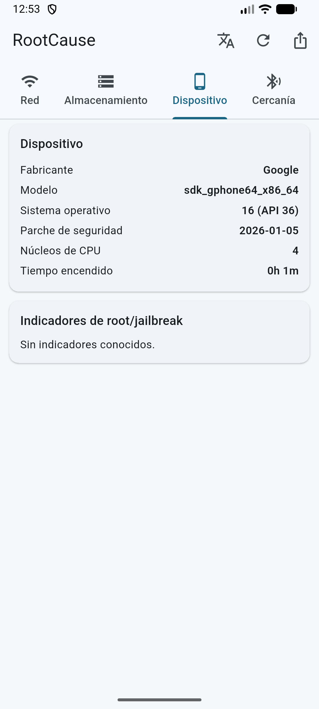

# Probar RootCause en el emulador (sin teléfono)

El **Android Emulator** oficial ejecuta un Android completo en tu PC, con
ventana interactiva: puedes tocar, navegar las pestañas y probar la app
exactamente como en un teléfono.

<p align="center">
  
  &nbsp;&nbsp;
  
</p>

> Capturas reales de v0.2.0 corriendo en el AVD "Medium Phone" con
> Android 16 (API 36).

## Camino 1 — Un solo comando (recomendado)

Desde la raíz del repo:

```powershell
.\scripts\emulador.ps1
```

El script arranca tu AVD **con ventana visible**, espera el boot, descarga
el APK universal del último release, lo instala y abre RootCause. Ideal
para probar cada release nuevo.

## Camino 2 — Android Studio (visual)

1. Android Studio → **Device Manager** (icono de teléfono a la derecha).
2. Si no tienes un dispositivo: *Create Virtual Device* → elige un
   teléfono (p. ej. "Medium Phone") → imagen de sistema reciente
   (API 34+) → Finish.
3. Pulsa **▶** — se abre la ventana del teléfono.
4. Descarga el APK **universal** del
   [último release](https://github.com/vladimiracunadev-create/rootcause-mobile-inspector/releases/latest)
   y **arrástralo sobre la ventana** del emulador: se instala solo.
5. Abre RootCause desde el cajón de apps.

## Camino 3 — Línea de comandos (reproducible)

```powershell
$sdk = "$env:LOCALAPPDATA\Android\Sdk"

# Ver qué AVDs tienes
& "$sdk\emulator\emulator.exe" -list-avds

# Arrancar con ventana
& "$sdk\emulator\emulator.exe" -avd <NOMBRE_AVD> -gpu auto

# En otra terminal: instalar y abrir
& "$sdk\platform-tools\adb.exe" install -r RootCause-Mobile-Inspector-<v>-android-universal.apk
& "$sdk\platform-tools\adb.exe" shell monkey -p com.rootcause.mobileinspector 1
```

## ¿Qué APK usa el emulador?

El emulador en PC ejecuta CPU **x86_64** → usa siempre el APK
**universal** (los APKs `arm64-v8a`/`armeabi-v7a` del release son para
teléfonos físicos y darán "app no instalada" en el emulador).

## Qué esperar dentro del emulador (honestidad)

| Señal | En el emulador |
|---|---|
| Semáforo, memoria, almacenamiento | ✅ Datos reales de la máquina virtual |
| Batería | 🟡 Simulada (100 %, "cargando", 25 °C) — puedes cambiarla en los controles extendidos del emulador (⋮ → Battery) |
| Auditoría de apps | 🟡 Un AVD limpio casi no tiene apps de usuario → verás 0-2 entradas |
| Sideload / root | 🟡 Las imágenes *Google Play* dan 0 indicadores; las imágenes AOSP (`test-keys`) mostrarán `build:test-keys` — correcto, ES un build de pruebas |
| Historial y export JSON | ✅ Funcionan igual que en un teléfono |

El emulador sirve para **probar UI y flujo**. La evaluación real de
detección se hace en un teléfono físico con apps de verdad.

## Si la ventana del emulador aparece cortada o fuera de pantalla

El emulador recuerda su última posición de ventana. Si quedó arrastrada
fuera del monitor (por ejemplo, solo se ve la mitad inferior), cierra el
emulador y borra su posición guardada:

```powershell
Remove-Item "$env:USERPROFILE\.android\avd\<NOMBRE_AVD>.avd\emulator-user.ini"
```

Al arrancar de nuevo, la ventana aparece centrada. `scripts/emulador.ps1`
hace esta corrección automáticamente si detecta una posición fuera de la
pantalla.

## Alternativas de terceros

BlueStacks, Genymotion, Waydroid (Linux), Windows Subsystem for Android
(descontinuado). Funcionan, pero el AVD oficial es el único que replica
Android sin modificaciones — mejor para validar comportamiento real.
