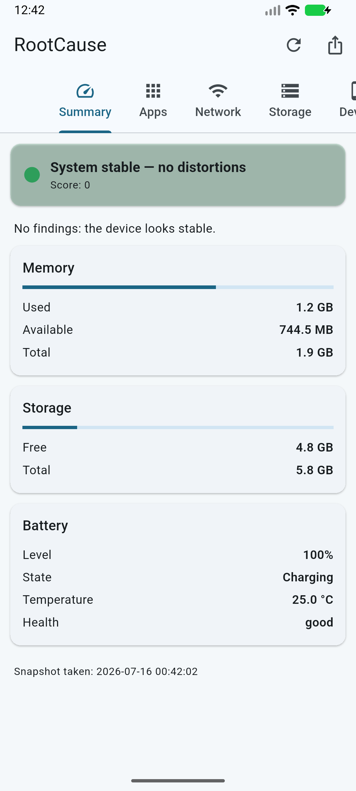
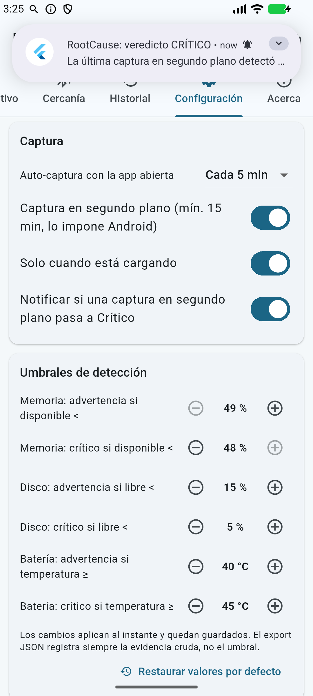

# Manual de usuario

RootCause Mobile Inspector observa tu teléfono y te dice, con evidencia,
si algo se comporta distinto. No necesita cuenta, no usa internet y no
envía nada a ninguna parte.

## La idea en una frase

> Cualquier distorsión anómala de los recursos del teléfono —memoria,
> almacenamiento, batería, permisos de apps— puede ser el primer indicio
> de un problema. RootCause vigila esas distorsiones y te dice dónde mirar.

## La primera vez que la abres

RootCause te muestra tres pantallas cortas (qué es, qué **no** es, y por
qué todo se queda en tu teléfono) y luego te hace **una sola pregunta**:
cuánta información quieres ver.

| Opción | Qué ves |
|---|---|
| **Simple** (recomendada, viene marcada) | Lo esencial: el semáforo, las apps señaladas y la configuración |
| **Normal** | Añade red, almacenamiento, dispositivo e historial |
| **Avanzado** | Todo, incluida la Cercanía Bluetooth |

Si no tocas nada y pulsas **Empezar**, te quedas con la **Simple**. Es a
propósito: la mayoría de la gente que instala esto lo hace porque sospecha
algo, no porque quiera un panel técnico. Todo lo demás sigue ahí y se
activa cuando quieras.

> **Puedes cambiarlo cuando sea** en **Configuración → Modo de
> visualización**. No pierdes nada: las capturas y el historial son los
> mismos en los tres modos, solo cambia cuánto se te muestra.

## El semáforo

  

Arriba de la pestaña **Resumen** siempre hay un veredicto:

- 🟢 **Normal** — nada fuera de lo esperado.
- 🟡 **Advertencia** — hay indicios que conviene revisar.
- 🔴 **Crítico** — hay una distorsión seria ahora mismo.

Debajo del semáforo aparecen los **hallazgos**: cada uno explica qué se
detectó, con qué evidencia y qué se recomienda hacer.

## Pestañas

### Resumen

Semáforo global, hallazgos activos y las tres métricas base: memoria
(usada/disponible), almacenamiento (libre/total) y batería (nivel,
temperatura, salud). El botón **actualizar** (↻) toma una captura nueva.

### Apps (Android)

Lista las apps de usuario ordenadas por **puntaje de riesgo**: cuántos
permisos peligrosos solicita cada una (cámara, micrófono, ubicación, SMS,
contactos…), si puede dibujar sobre otras apps (overlay), si puede instalar
paquetes, y si llegó por **sideload** (fuera de una tienda conocida).

Importante y honesto: un puntaje alto **no significa que la app sea
maliciosa** — significa que su superficie de permisos merece una mirada.
En iPhone esta pestaña indica que el sistema no permite listar apps: no es
un fallo de RootCause, es diseño de iOS.

Desde v0.4.0, si concedes el **acceso de uso** (permiso especial que solo
tú puedes dar, en Ajustes del sistema — la app te lleva con un botón),
cada app muestra su **tiempo en pantalla de las últimas 24 h** y la lista
se ordena por consumo: la respuesta directa a "¿qué app me está gastando
el teléfono?". Sin el permiso, esa columna simplemente no existe.

### Red

Tipo de conexión (WiFi/celular/ethernet), si hay **VPN activa**, si la red
es medida, ancho de banda estimado y tráfico total acumulado desde el
arranque. RootCause no inspecciona tu tráfico: solo lee contadores del SO.

### Almacenamiento

Espacio libre y usado del volumen interno de datos **y de cada volumen
adicional**: si tu teléfono tiene **tarjeta SD** (o un USB conectado),
aparece como su propia tarjeta con libre/total y marcada como extraíble.
Sin tarjeta, la sección simplemente no aparece — es el caso normal, no un
error. También ves cuánto ocupa la caché propia de RootCause, con un botón
para **limpiarla** (la única caché que una app puede limpiar es la suya).

### Dispositivo

Fabricante, modelo, versión de OS, **capa del fabricante** (One UI, MIUI,
ColorOS… — solo si tu equipo la tiene), **parche de seguridad**, núcleos de
CPU, tiempo encendido e **indicadores de root/jailbreak**. Un indicador es
un indicio (un binario `su` presente, un build firmado con test-keys), no
una prueba definitiva.

### Cercanía (v0.2.0)

Escaneo **manual** de dispositivos Bluetooth LE cercanos, con intensidad
de señal. Si un dispositivo reaparece a lo largo de varios escaneos de la
sesión se marca **PERSISTENTE** — así se comporta un rastreador ajeno,
pero también tus propios audífonos: indicio, no prueba. Todo es local y
bajo demanda; nada se guarda ni se exporta, y la app sigue sin usar
internet. La primera vez Android pedirá el permiso de **dispositivos
cercanos** (Bluetooth).

### Historial

Cada captura queda guardada en el teléfono (últimas 500). Desde v0.3.0
además lo VES: un **gráfico de tendencia** (RAM disponible y disco libre
sobre las últimas capturas) y **comparación A → B** — tocas dos capturas
y te muestra los deltas de memoria, disco, puntaje y apps riesgosas. Con
la auto-captura activada, el historial se alimenta solo y la regla de
**carga en ascenso** avisa cuando algo consume recursos de forma
sostenida.

### El sensor que avisa (v0.3.0)

  

Dos vigilantes automáticos:

- **Alerta de crítico**: si una captura en segundo plano pasa a CRÍTICO,
  el teléfono te lo notifica — solo en la transición, no cada 15 minutos.
  Es una notificación **local**: la app sigue sin usar internet.
- **Apps nuevas**: cada captura compara las apps instaladas contra la
  anterior. Si apareció una que no estaba, sale como hallazgo con sus
  permisos — el malware llega instalándose, y esto lo delata aunque tú no
  hayas abierto la app en días. La primera captura no acusa a nadie: solo
  registra lo que ya había.

### Configuración (v0.2.0)

Como en el RootCause de escritorio:

- **Auto-captura con la app abierta**: cada 5 minutos por defecto
  (1/5/15 min o apagada).
- **Captura en segundo plano**: incluso con la app cerrada, mínimo cada
  15 minutos (lo impone Android, no RootCause), con opción de hacerlo
  **solo cuando el teléfono está cargando**.
- **Umbrales de detección** modificables al instante.
- **Notificación de crítico** en segundo plano (activada por defecto;
  Android 13+ pedirá el permiso de notificaciones la primera vez).
- **Idioma** español/inglés.

Todo persiste entre sesiones.

### Acerca

Versión, autor, licencia y la política de privacidad local.

## Widget de pantalla de inicio (v0.4.0)

Mantén pulsada la pantalla de inicio → **Widgets** → RootCause: el
semáforo, el puntaje y la hora de la última captura, sin abrir la app.
Se actualiza solo tras cada captura (incluidas las de segundo plano) y
al tocarlo abre RootCause.

## Intervenir desde un hallazgo

Los hallazgos de almacenamiento y batería traen un botón que abre la
pantalla **del sistema** donde tú puedes actuar (liberar espacio, ver el
uso de batería), y cada app de la auditoría tiene **"Ver en el sistema"**
para desinstalarla o revocarle permisos ahí mismo. RootCause no puede
hacer eso por ti — ninguna app puede, es diseño de Android — pero te deja
a un toque del lugar donde sí se puede.

## Exportar evidencia

El botón de **exportar** copia la captura actual como JSON al
portapapeles y además la guarda como archivo en la carpeta de documentos
de la app (la ruta exacta aparece en pantalla al exportar). El formato usa
ids estables (`mem-pressure`, `risky-apps`…) para que la evidencia sea
comparable entre dispositivos y con RootCause para Windows.

## Idioma

La app está en **español e inglés** — español por defecto, como toda la
familia RootCause. El botón 🌐 de la barra superior cambia al inglés y la
preferencia se recuerda entre sesiones.

## "Consumo fuera de lo habitual" (v0.8.0)

Este hallazgo aparece cuando una app **gasta mucho más de lo que ella misma
gastaba antes** — datos móviles/WiFi o tiempo en pantalla.

No hay una cifra fija de "cuántos megas al día son demasiados", porque no
existe: un reproductor de vídeo gasta muchísimo y es normal, una app de
notas gasta casi nada. Por eso RootCause compara **cada app consigo
misma**. Una app de notas que siempre movió 2 MB al día y hoy sube 700 MB
no rompe ningún límite del teléfono, pero se delata contra su costumbre.

**Lo primero que debes preguntarte: ¿la usaste tú más de lo normal?** Si la
respuesta es sí, no hay misterio. Si es que no, mira qué permisos tiene
concedidos y abre su ficha del sistema.

Se pone **rojo** cuando, además del consumo disparado, esa app tiene una
capacidad de espionaje activa (leer tu pantalla, leer tus notificaciones o
administrar el dispositivo). Esa combinación es la que de verdad importa.

**Necesita tiempo para funcionar.** Para saber qué es "lo habitual" de una
app hace falta historial: unas **24-48 horas** de uso con el acceso de uso
concedido. Antes de eso RootCause no dice nada — prefiere callarse a
inventar. Y ojo con lo que esto significa: si el teléfono ya estaba
comprometido cuando instalaste RootCause, ese consumo alto es lo que
aprenderá como "normal". Detecta **cambios**, no un problema que ya venía.

## "App instalada al empezar el deterioro" (v0.8.0)

Cuando la memoria o el disco llevan un rato cayendo sin parar **y** hay una
app que se instaló justo en ese periodo, RootCause te lo dice.

**Coincidir en el tiempo no es ser la causa**, y la app lo deja claro: es
el primer sitio donde mirar, no un culpable. Si no reconoces la
instalación, revísala en **Señaladas**. Si sí la reconoces y aun así
sospechas, la comprobación que sí resuelve la duda es desinstalarla un rato
y comparar dos capturas en el **Historial**.

## Qué NO hace esta app

- No elimina malware ni "limpia" el teléfono.
- No mata procesos de otras apps (el SO no lo permite).
- No lee tu tráfico, mensajes ni archivos personales.
- No usa internet: la evidencia solo sale si tú la exportas.
- No acusa a una app de espiarte. Te muestra indicios con evidencia para
  que tú decidas — un consumo raro puede ser espionaje o puede ser que ese
  día usaste mucho esa app.
