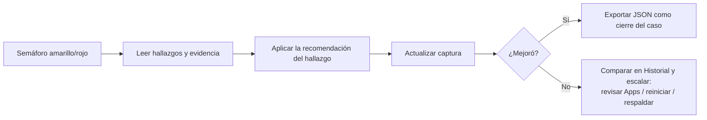

# Operación

Guía de operación día a día de RootCause Mobile Inspector: cómo capturar,
leer el semáforo, acumular historial y archivar evidencia. Complementa al
[MANUAL_USUARIO.md](MANUAL_USUARIO.md) (qué hace cada pestaña) y a
[HEURISTICAS.md](HEURISTICAS.md) (la especificación exacta de cada regla).

---

## 1) Primera captura

1. Abre la app: captura automáticamente el estado del dispositivo al arrancar.
2. Mira el semáforo del tab **Resumen** (banner superior con veredicto y puntaje).
3. Revisa los hallazgos listados debajo: cada uno trae evidencia y recomendación.
4. Cada captura queda guardada en el historial local — no hay que hacer nada extra.

No hay captura en segundo plano: la app solo captura al abrirse o cuando pulsas
**Actualizar** (icono ↻). Es deliberado: un sensor que corre solo consumiría los
mismos recursos que dice vigilar.

---

## 2) Lectura del semáforo

| Color | Veredicto | Significado |
|---|---|---|
| Verde | Sistema estable — sin distorsiones | Ninguna regla disparó |
| Amarillo | Advertencia — hay indicios que revisar | Al menos un hallazgo de advertencia (+3 al puntaje cada uno) |
| Rojo | Crítico — distorsión seria en curso | Al menos un hallazgo crítico (+10 al puntaje cada uno) |

El puntaje suma los pesos de todos los hallazgos: sirve para comparar capturas
entre sí, no como valor absoluto. Un hallazgo es un **indicio, no una prueba** —
la app te dice dónde mirar, no dicta sentencia.

---

## 3) Frecuencia recomendada

- **Sin síntomas:** una captura ocasional (semanal basta) para tener línea base.
- **Con síntomas** (calor, lentitud, batería que se agota): captura al notar el
  síntoma y otra tras reiniciar o cerrar apps — comparar ambas en el historial
  dice si la intervención sirvió.
- **Tras instalar una app nueva:** captura y revisa el tab **Apps** por si la
  superficie de permisos cambió.

---

## 4) Interpretación del historial

El tab **Historial** lista las capturas más recientes (la app retiene las
últimas 500 en JSON Lines). Cada fila muestra severidad, puntaje, % de RAM
disponible, % de disco libre y conteo de apps riesgosas.

Qué buscar:

- **Tendencia, no foto:** un amarillo aislado tras abrir un juego pesado es
  normal; un amarillo que se repite en reposo merece diagnóstico.
- **Puntaje creciente entre capturas comparables** (misma hora, mismo uso) es
  la señal más útil de que algo empeora.
- **Apps riesgosas que suben** sin que hayas instalado nada: revisa el tab Apps.

---

## 5) Exportar y archivar evidencia

El botón **Exportar JSON forense** hace dos cosas a la vez:

1. copia el JSON completo (snapshot + veredicto) al portapapeles,
2. lo guarda como `rootcause-snapshot-<timestamp>.json` en el sandbox de la app.

Para archivarlo fuera del teléfono: pega el portapapeles donde te sirva
(nota, correo a ti mismo) o extráelo por USB con adb (comandos en
[COMMANDS.md](COMMANDS.md)). El export **nunca se traduce**: los ids de
hallazgo son estables para poder comparar evidencia entre idiomas y versiones.

---

## 6) Ante un veredicto amarillo o rojo

Diagnóstico primero, intervención después: no desinstales nada hasta leer la
evidencia del hallazgo. La app no mata procesos ni borra datos por ti — en
móvil el sistema operativo no lo permite ([LIMITACIONES.md](LIMITACIONES.md)) y
las decisiones son tuyas.

---

## 7) Dónde viven los datos y cómo se borran

| Dato | Archivo | Ubicación |
|---|---|---|
| Historial (máx. 500 capturas) | `rootcause-history.jsonl` | Sandbox de la app |
| Exports JSON | `rootcause-snapshot-<timestamp>.json` | Sandbox de la app |
| Preferencia de idioma (ES/EN) | `rootcause-language` | Sandbox de la app |

El sandbox es el directorio privado de la app (en Android, el `filesDir` de
`com.rootcause.mobileinspector`; en iOS, su carpeta Documents). Ninguna otra
app puede leerlo, nada sale del dispositivo (la app no declara el permiso
INTERNET en release) y **desinstalar la app borra todo**: historial, exports y
preferencias. No queda residuo. Detalle completo en
[POLITICA_DE_PRIVACIDAD_LOCAL.md](POLITICA_DE_PRIVACIDAD_LOCAL.md).
