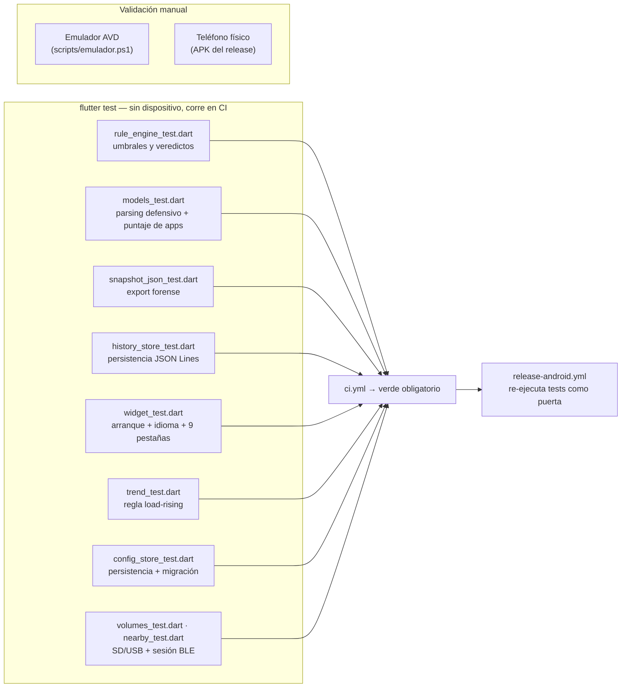

# Estrategia de testing

## Qué se testea y dónde



## Diseño: por qué el núcleo es 100 % testeable

El motor de reglas, los modelos, el export y el historial son **Dart puro
sin Android/iOS**: los tests corren en la JVM de CI en segundos, sin
emulador. Lo único no testeable sin dispositivo son los colectores
nativos — por eso son **delgados** (solo leen APIs y arman un mapa) y el
lado Dart valida defensivamente todo lo que reciben.

## Cobertura por archivo

| Suite | Qué garantiza |
|---|---|
| `rule_engine_test.dart` | Cada familia de regla dispara en su umbral exacto (warning y critical), el flag `lowMemory` fuerza CRITICAL, la temperatura no disponible (iOS) omite la regla, el veredicto global es el máximo y el puntaje suma 3/10, y los umbrales personalizados (`RuleThresholds`) cambian el resultado |
| `models_test.dart` | Un mapa vacío o con tipos basura del nativo degrada a snapshot neutro **sin crash**; la política de puntaje de apps (+1 permiso, +3 overlay/installer, +2 admin/sideload) y sus cortes 8/12 |
| `snapshot_json_test.dart` | El export es JSON válido con `schemaVersion`, los ids de hallazgo salen sin traducir, `toJsonLine` es una sola línea parseable, y los caracteres especiales en etiquetas no rompen el formato |
| `history_store_test.dart` | Orden más-reciente-primero, retención exacta (`maxRows`), una línea corrupta se ignora sin perder el resto, historial vacío no falla |
| `trend_test.dart` | `load-rising` dispara solo con caída sostenida (≥ 4 puntos, ventana 6 h, caída ≥ 15 pts); rebotes, series cortas, capturas viejas y caídas pequeñas NO alarman; memoria y disco son independientes |
| `config_store_test.dart` | Defaults correctos, round-trip completo, config corrupto degrada sin crash, migración del archivo de idioma v0.1.x, los umbrales alimentan el motor |
| `volumes_test.dart` | Sin campo `volumes` → lista vacía (teléfono sin SD); entradas basura degradan a neutro; el export JSON incluye los volúmenes |
| `nearby_test.dart` | Acumulación entre escaneos, persistencia exige ≥ 3 escaneos Y ≥ 10 min, resultados malformados se ignoran, el nombre conocido no se pierde |
| `baseline_store_test.dart` | Primera captura inicializa EN SILENCIO, app nueva aparece UNA vez, reinstalar cuenta de nuevo, sin auditoría (iOS) no hay baseline, corrupto se reconstruye sin acusar |
| `capture_service_test.dart` | La transición a crítico dispara `wentCritical` una sola vez (crítico sostenido no repite), y el hallazgo `new-apps` lleva cantidad, nombres y cuántas son riesgosas |
| `patch_test.dart` | `patch-old` dispara en 180/365 días con la edad como evidencia, se omite con parche reciente o fecha no parseable (iOS); el uso por app degrada a -1 sin permiso y `usageAccessGranted` a false |
| `widget_test.dart` | La app completa arranca sin canal nativo (MissingPluginException capturada), renderiza las 9 pestañas, arranca **en español por defecto** aunque el sistema esté en inglés y el botón de idioma cambia a inglés |

## Ejecutar

```bash
flutter test                 # toda la suite
flutter test test/rule_engine_test.dart   # una suite
.\scripts\ci-local.ps1       # réplica completa de la CI (formato+analyze+tests+APK)
```

## Las tres puertas de calidad

1. **Local**: `scripts/ci-local.ps1` antes de pushear.
2. **CI** (`ci.yml`): formato + análisis estático + tests en cada push/PR.
3. **Release** (`release-android.yml`): los tests se re-ejecutan antes de
   compilar el APK — un tag sobre código roto **no publica**.

## Lo que los tests NO cubren (honestidad)

- Los colectores Kotlin/Swift reales (requieren dispositivo). Mitigación:
  código delgado + validación defensiva en Dart + prueba manual en
  emulador/teléfono antes de cada release ([EMULADOR.md](EMULADOR.md)).
- El Worker de captura en segundo plano y el escaneo BLE nativos: se
  verifican manualmente en el emulador (forzando el job con
  `cmd jobscheduler run` y comprobando que el historial crece; escaneo
  desde la pestaña Cercanía). La lógica Dart de ambos (entrypoint,
  sesión BLE, config) sí está cubierta por tests.
- Rendimiento con cientos de apps instaladas (la enumeración corre fuera
  del hilo de UI; verificado manualmente).
