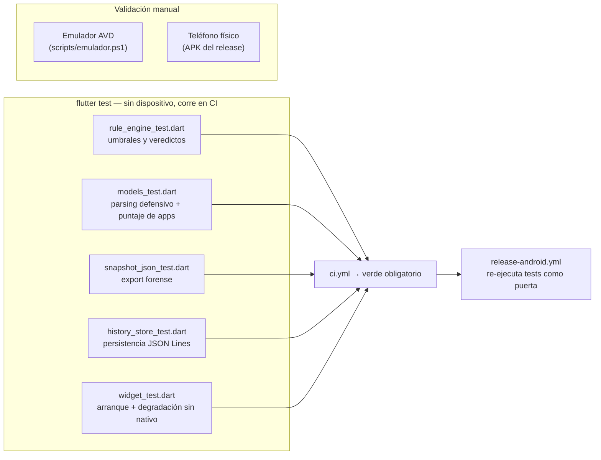

# Estrategia de testing

## Qué se testea y dónde



## Diseño: por qué el núcleo es 100 % testeable

El motor de reglas, los modelos, el export y el historial son **Dart puro
sin Android/iOS**: los tests corren en la JVM de CI en segundos, sin
emulador. Lo único no testeable sin dispositivo son los colectores
nativos — por eso son **delgados** (solo leen APIs y arman un mapa) y el
lado Dart valida defensivamente todo lo que reciben.

## Cobertura por archivo

| Suite | Qué garantiza |
|---|---|
| `rule_engine_test.dart` | Cada familia de regla dispara en su umbral exacto (warning y critical), el flag `lowMemory` fuerza CRITICAL, la temperatura no disponible (iOS) omite la regla, el veredicto global es el máximo y el puntaje suma 3/10, y los umbrales personalizados (`RuleThresholds`) cambian el resultado |
| `models_test.dart` | Un mapa vacío o con tipos basura del nativo degrada a snapshot neutro **sin crash**; la política de puntaje de apps (+1 permiso, +3 overlay/installer, +2 admin/sideload) y sus cortes 8/12 |
| `snapshot_json_test.dart` | El export es JSON válido con `schemaVersion`, los ids de hallazgo salen sin traducir, `toJsonLine` es una sola línea parseable, y los caracteres especiales en etiquetas no rompen el formato |
| `history_store_test.dart` | Orden más-reciente-primero, retención exacta (`maxRows`), una línea corrupta se ignora sin perder el resto, historial vacío no falla |
| `widget_test.dart` | La app completa arranca sin canal nativo (MissingPluginException capturada) y renderiza las 7 pestañas |

## Ejecutar

```bash
flutter test                 # toda la suite
flutter test test/rule_engine_test.dart   # una suite
.\scripts\ci-local.ps1       # réplica completa de la CI (formato+analyze+tests+APK)
```

## Las tres puertas de calidad

1. **Local**: `scripts/ci-local.ps1` antes de pushear.
2. **CI** (`ci.yml`): formato + análisis estático + tests en cada push/PR.
3. **Release** (`release-android.yml`): los tests se re-ejecutan antes de
   compilar el APK — un tag sobre código roto **no publica**.

## Lo que los tests NO cubren (honestidad)

- Los colectores Kotlin/Swift reales (requieren dispositivo). Mitigación:
  código delgado + validación defensiva en Dart + prueba manual en
  emulador/teléfono antes de cada release ([EMULADOR.md](EMULADOR.md)).
- Rendimiento con cientos de apps instaladas (la enumeración corre fuera
  del hilo de UI; verificado manualmente).
