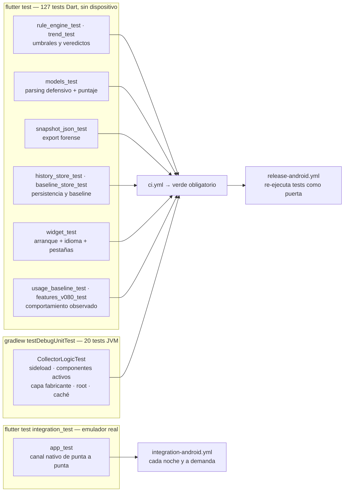

# Estrategia de testing

## Qué se testea y dónde


```mermaid
flowchart LR
    subgraph DART["flutter test — 127 tests Dart, sin dispositivo"]
        T1["rule_engine_test · trend_test<br/>umbrales y veredictos"]
        T2["models_test<br/>parsing defensivo + puntaje"]
        T3["snapshot_json_test<br/>export forense"]
        T4["history_store_test · baseline_store_test<br/>persistencia y baseline"]
        T5["widget_test<br/>arranque + idioma + pestañas"]
        T6["usage_baseline_test · features_v080_test<br/>comportamiento observado"]
    end
    subgraph KOTLIN["gradlew testDebugUnitTest — 20 tests JVM"]
        K1["CollectorLogicTest<br/>sideload · componentes activos<br/>capa fabricante · root · caché"]
    end
    subgraph EMU["flutter test integration_test — emulador real"]
        I1["app_test<br/>canal nativo de punta a punta"]
    end
    T1 & T2 & T3 & T4 & T5 & T6 --> CI["ci.yml → verde obligatorio"]
    K1 --> CI
    I1 --> NIGHT["integration-android.yml<br/>cada noche y a demanda"]
    CI --> REL["release-android.yml<br/>re-ejecuta tests como puerta"]
```

## Diseño: por qué el núcleo es 100 % testeable

El motor de reglas, los modelos, el export y el historial son **Dart puro
sin Android/iOS**: los tests corren en la JVM de CI en segundos, sin
emulador.

Hasta v0.7.0 la capa nativa era el punto ciego: 1.500 líneas de Kotlin y
Swift sin un solo test, y es justo la capa donde nació el crash de arranque
de v0.2.0. Desde v0.8.0 la estrategia es partirla en dos:

- **Lo que decide** (parsear, clasificar, sumar) vive en
  [`CollectorLogic.kt`](../android/app/src/main/kotlin/com/rootcause/mobileinspector/CollectorLogic.kt),
  **sin una sola dependencia de Android** → 20 tests JVM que corren en
  segundos. La regla para mover algo ahí es simple: si se puede escribir un
  test que falle cuando la lógica esté mal, va ahí.
- **Lo que pide el dato al SO** se queda en `AndroidCollectors` y sigue
  siendo delgado, con validación defensiva en Dart de todo lo que entrega.
- **El camino completo** (Kotlin ↔ MethodChannel ↔ Dart) lo cubre el test
  de integración en un emulador real.

## Cobertura por archivo

| Suite | Qué garantiza |
|---|---|
| `rule_engine_test.dart` | Cada familia de regla dispara en su umbral exacto (warning y critical), el flag `lowMemory` fuerza CRITICAL, la temperatura no disponible (iOS) omite la regla, el veredicto global es el máximo y el puntaje suma 3/10, y los umbrales personalizados (`RuleThresholds`) cambian el resultado |
| `models_test.dart` | Un mapa vacío o con tipos basura del nativo degrada a snapshot neutro **sin crash**; la política de puntaje de apps (+1 permiso, +3 overlay/installer, +2 admin/sideload) y sus cortes 8/12 |
| `snapshot_json_test.dart` | El export es JSON válido con `schemaVersion`, los ids de hallazgo salen sin traducir, `toJsonLine` es una sola línea parseable, y los caracteres especiales en etiquetas no rompen el formato |
| `history_store_test.dart` | Orden más-reciente-primero, retención exacta (`maxRows`), una línea corrupta se ignora sin perder el resto, historial vacío no falla |
| `trend_test.dart` | `load-rising` dispara solo con caída sostenida (≥ 4 puntos, ventana 6 h, caída ≥ 15 pts); rebotes, series cortas, capturas viejas y caídas pequeñas NO alarman; memoria y disco son independientes |
| `config_store_test.dart` | Defaults correctos, round-trip completo, config corrupto degrada sin crash, migración del archivo de idioma v0.1.x, los umbrales alimentan el motor |
| `volumes_test.dart` | Sin campo `volumes` → lista vacía (teléfono sin SD); entradas basura degradan a neutro; el export JSON incluye los volúmenes |
| `nearby_test.dart` | Acumulación entre escaneos, persistencia exige ≥ 3 escaneos Y ≥ 10 min, resultados malformados se ignoran, el nombre conocido no se pierde |
| `baseline_store_test.dart` | Primera captura inicializa EN SILENCIO, app nueva aparece UNA vez, reinstalar cuenta de nuevo, sin auditoría (iOS) no hay baseline, corrupto se reconstruye sin acusar |
| `capture_service_test.dart` | La transición a crítico dispara `wentCritical` una sola vez (crítico sostenido no repite), y el hallazgo `new-apps` lleva cantidad, nombres y cuántas son riesgosas |
| `patch_test.dart` | `patch-old` dispara en 180/365 días con la edad como evidencia, se omite con parche reciente o fecha no parseable (iOS); el uso por app degrada a -1 sin permiso y `usageAccessGranted` a false |
| `widget_test.dart` | La app completa arranca sin canal nativo (MissingPluginException capturada), renderiza las 3 pestañas del modo básico, **autodetecta el idioma del equipo** y el menú permite cambiarlo |
| `usage_baseline_test.dart` | La regla de comportamiento **NO acusa** sin muestras independientes, ni por debajo del suelo absoluto, ni cuando el dato es `-1` (sin acceso de uso), ni en iOS; la mediana ignora un día raro; línea base cero sí es anomalía; el muestreo horario no engorda el archivo; desinstalar borra el historial; archivo corrupto se reconstruye |
| `features_v080_test.dart` | `app-usage-anomaly` es CRÍTICO solo con capacidad de espionaje activa; la notación `×N`/`×∞` es neutral al idioma; `load-rising-suspect` exige deterioro **Y** instalación reciente; la inicialización del baseline no cuenta como instalación observada; los dos hallazgos nuevos están traducidos a los 5 idiomas |
| `CollectorLogicTest.kt` (JVM) | Sideload incluye el instalador ausente; el parseo de componentes activos tolera el formato de las capas de fabricante; One UI `80500` → `8.5`; un equipo limpio no genera indicadores de root y una propiedad ausente no crea indicios fantasma; el tamaño de caché recorre el árbol sin recursión |

## Ejecutar

```bash
flutter test                 # los 127 tests Dart
```

```bash
cd android && ./gradlew :app:testDebugUnitTest
```

```bash
flutter test integration_test   # requiere emulador o teléfono conectado
```

```bash
bash scripts/check-no-internet.sh   # tras un flutter build apk --release
```

## Las tres puertas de calidad

1. **Local**: `scripts/ci-local.ps1` antes de pushear.
2. **CI** (`ci.yml`): formato + análisis estático + tests en cada push/PR.
3. **Release** (`release-android.yml`): los tests se re-ejecutan antes de
   compilar el APK — un tag sobre código roto **no publica**.

## Lo que los tests NO cubren (honestidad)

- **La lectura real de las APIs del SO** en Kotlin/Swift: `CollectorLogic`
  cubre lo que se decide, pero no lo que el sistema **entrega**. Un cambio
  de comportamiento de Android en un fabricante concreto sigue necesitando
  el dispositivo. Mitigación: código delgado, validación defensiva en Dart,
  test de integración en emulador y prueba manual antes de cada release
  ([EMULADOR.md](EMULADOR.md)).
- **La capa Swift de iOS no tiene equivalente a `CollectorLogic`**: la
  extracción de v0.8.0 se hizo solo en Android, que es la plataforma que
  se distribuye. Queda pendiente si iOS sale de pausa.
- El Worker de captura en segundo plano y el escaneo BLE nativos: se
  verifican manualmente en el emulador (forzando el job con
  `cmd jobscheduler run` y comprobando que el historial crece; escaneo
  desde la pestaña Cercanía). La lógica Dart de ambos (entrypoint,
  sesión BLE, config) sí está cubierta por tests.
- Rendimiento con cientos de apps instaladas (la enumeración corre fuera
  del hilo de UI; verificado manualmente).
