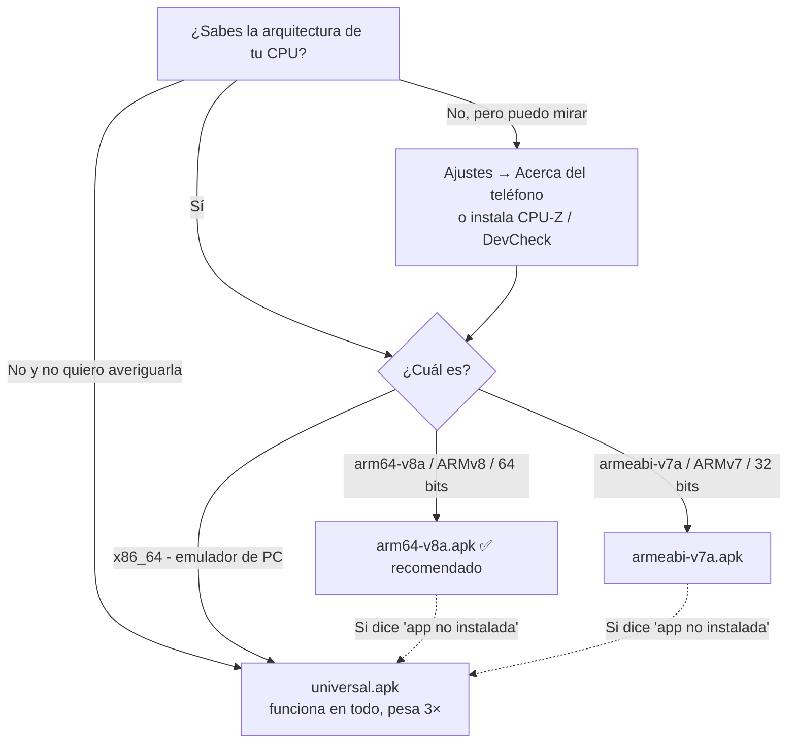

# Troubleshooting

## Instalación del APK

### ¿Cuál APK descargo? (guía completa)



**Regla práctica sin mirar nada**: si tu teléfono es de **2017 o
posterior** (cualquier Samsung/Xiaomi/Motorola/Pixel/Huawei de gama media
o alta), es **arm64-v8a** con ~99 % de certeza. Los APK por ABI pesan ≈
16 MB contra 45 MB del universal.

**Cómo confirmar tu arquitectura, de más fácil a más técnico:**

1. **Por año/gama** (regla de arriba): 2017+ → `arm64-v8a`.
2. **En el teléfono**: instala una app de info de hardware (CPU-Z,
   DevCheck, AIDA64) y mira "CPU Architecture" / "Instruction Set":
   - `ARMv8`, `AArch64`, `arm64` → `arm64-v8a`
   - `ARMv7`, `armeabi` → `armeabi-v7a`
3. **Con cable y ADB** (para técnicos):

   ```bash
   adb shell getprop ro.product.cpu.abi
   # → arm64-v8a  |  armeabi-v7a  |  x86_64
   ```

4. **Emulador de Android en PC** (Android Studio/AVD): la imagen es
   `x86_64` → usa el **universal** (incluye esa ABI).

**¿Y si elijo mal?** No pasa nada grave: Android muestra "Aplicación no
instalada" y listo — descarga entonces el `universal`, que funciona en
cualquier equipo a cambio de peso extra.

> ¿Por qué el universal pesa ~45 MB? Empaqueta el engine de Flutter y el
> código AOT para **tres arquitecturas de CPU a la vez** (cada una ~15 MB).
> Detalle completo del trade-off (y por qué la edición Windows en Rust
> pesa menos) →
> [`ARCHITECTURE.md`](ARCHITECTURE.md#trade-off-honesto-peso-del-apk-flutter-vs-rust).

### Problemas frecuentes

| Síntoma | Causa | Solución |
|---|---|---|
| "Aplicación no instalada" al usar un APK por ABI | ABI equivocada para tu CPU | Usa `arm64-v8a` (lo normal) o el `universal` |
| "Aplicación no instalada" | Ya existe una versión firmada con otra clave (releases con firma efímera) | Desinstala la versión anterior e instala de nuevo |
| Android bloquea la instalación | Orígenes desconocidos no autorizados | Ajustes → Apps → tu navegador → "Instalar apps desconocidas" |
| Play Protect advierte | App fuera de Play Store, sin historial de reputación | Verifica el SHA-256 contra `SHA256SUMS.txt` del release y continúa |
| "App no compatible" | Android < 8.0 (API 26) | Versión mínima soportada: Android 8.0 |

## Uso de la app

| Síntoma | Causa | Solución |
|---|---|---|
| La pestaña Apps tarda unos segundos | Enumerar paquetes + permisos es costoso en equipos con muchas apps | Es normal; la captura corre fuera del hilo de UI |
| Temperatura de batería "No disponible" | El fabricante no la reporta (o es iOS) | Limitación del SO, no un fallo |
| Historial vacío tras reinstalar | El historial vive en el sandbox y se borra al desinstalar | Exporta el JSON antes de desinstalar si quieres conservar evidencia |
| El veredicto parece "muy sensible" | Umbrales por defecto | Los umbrales viven en `RuleThresholds` (`lib/core/rule_engine.dart`); configurables en una versión futura |

## Desarrollo / build

| Síntoma | Causa | Solución |
|---|---|---|
| `flutter doctor` no ve el SDK de Android | `ANDROID_HOME` sin definir | Apunta a tu SDK (típicamente `%LOCALAPPDATA%\Android\Sdk`) |
| Licencias Android sin aceptar | Primera vez con el SDK | `flutter doctor --android-licenses` |
| `dart format` falla en CI | Formato distinto al canónico | Corre `dart format lib test` y commitea |
| El build iOS falla en Windows/Linux | Xcode solo existe en macOS | Usa el job `build-ios` de la CI |
| El APK release no respeta mi keystore | Variables de entorno de firma sin definir | Ver [`BUILD_MOVIL.md`](BUILD_MOVIL.md) sección "Firma release" |

¿Algo que no está aquí? Abre un issue con: versión de la app, versión de
Android, pasos y captura del error.
